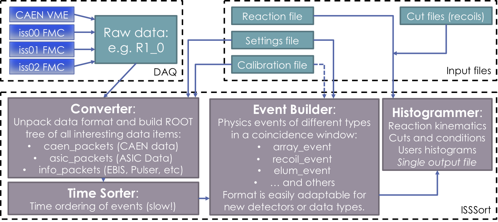

# ISSSort

A code for sorting raw data from the ISOLDE Solendoidal Spectrometer in MIDAS format.

## Download

```bash
git clone https://github.com/ISOLDESolenoidalSpectrometer/ISSSort
```

## Compile

```bash
make clean
make
```


## Execute

```
iss_sort
```
if you add the ISSSort/bin to your PATH variable. You can also add ISSSort/lib to your (DY)LD_LIBRARY_PATH too.

or
```
./bin/iss_sort
```

The input options are described below

```
use iss_sort with following flags:
        [-i <vector<string>>: List of input files]
        [-m <int           >: Monitor input file every X seconds]
        [-p <int           >: Port number for web server (default 8030)]
        [-o <string        >: Output file for histogram file]
        [-d <string        >: Data directory to add to the monitor]
        [-f                 : Flag to force new ROOT conversion]
        [-e                 : Flag to force new event builder (new calibration)]
        [-s <string        >: Settings file]
        [-c <string        >: Calibration file]
        [-r <string        >: Reaction file]
        [-h                 : Print this help]
```

## Sorting Philosophy

The code can be run entirely with default values, meaning that none of the additional input files are required in order to sort the data.

### Step 1: Converter
Running iss_sort with a list of input files, using the -i flag, will simple convert them to ROOT format.
This step produces one output file per input file, which has the name of the input file, appended with .root.

If a calibration file is added with the -c flag, the ADC data is calibrated for energy.
An example calibration file is included in the source of this code, including a description of the format.

A settings file can also be included with the -s flag to overwrite any of the defaults for the configuration of the electronics and detectors.
An example settings file is included in the source of this code, including a description of the format.

The ouptut file contains a single ROOT tree of the data and a series of diagnostic histograms and singles spectra.
If the output file already exists, iss_sort will skip this step unless the -f flag is used.

### Step 2: Time Sorting
In order to combine timestamp and ADC data, the time sorting step needs to be performed.
This step always follows the conversion step and will produce a new output file, appended with _sort.root.
This is potentially the slowest part of the process if there is a lot of data out of order due to the number of I/O operations.

### Step 3: Event Builder
The next step is the event builder, which runs if the -e flag is used, or automatically if a new file has been converted.
This uses the calibrated, time sorted data from the previous step to produce one output file per input, appended with _events.root.
The same settings file from the Converter step is reused for the same parameters, plus the length of the build window (default 3 µs).
There is a plan to have these setting written in to the ROOT file itself, so the file doesn't need to be passed again, but this isn't the case yet.

Events are built according to the particles on the array, correlating n- and p-side data, and also for recoil events, elum events, and ZeroDegree events in separate classes.
This format is all contained within the ISSEvts class, which you can browse to see which functions are available.
If you open the output file and want to draw directly from the evt_tree, you can load the library with .L /path/to/ISSSort/lib/libiss_sort.so or by adding it to your .rootlogon.C.
Then you have access to all the member functions like array_event->GetZ(), recoil_event-GetEnergyLoss(), elum_event->GetSector(), etc.

### Step 4: Histogramming
Finally a bunch of standard physics histograms are built using input from the reaction file, given with the -r flag.
An example reaction file is included in the source of this code, including a description of the format.

The code will now chain together all of the event trees from the previous step to produce a single output file given with the -o flag.
The default file name will be the first input file appended with _hists.root.

Users can edit this code as they please, producing their own plots.
There is no "user input" specifically, but if there are extra histograms that are of use to the community, please send me an email or raise 
a feature request on GitHub and I will consider adding it to the standard code.

## Dependencies

You also need to have ROOT installed with a minumum standard that your compiler supports C++14. At the moment it works with v5 or v6, but let me know of any problems.



